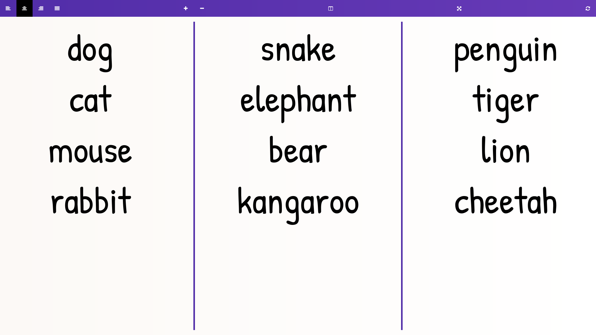

# Scratchpad

Digital whiteboard to write notes.

[](https://github.com/SidRoberts/scratchpad/actions)

[](https://github.com/SidRoberts/scratchpad/issues)
[](https://github.com/SidRoberts/scratchpad/pulls)



## Usage

Access via [https://sidroberts.co.uk/scratchpad](https://sidroberts.co.uk/scratchpad).

Alternatively, use the Docker image [`sidroberts/scratchpad`](https://hub.docker.com/repository/docker/sidroberts/scratchpad):

```bash
docker run -p 80:80 sidroberts/scratchpad
```

### Keyboard Shortcuts

| Windows Shortcut | MacOS Shortcut     | Action                   |
|------------------|--------------------|--------------------------|
| Ctrl Alt 1       | Command Option 1   | Left text alignment      |
| Ctrl Alt 2       | Command Option 2   | Centre text alignment    |
| Ctrl Alt 3       | Command Option 3   | Right text alignment     |
| Ctrl Alt 4       | Command Option 4   | Justified text alignment |
| Ctrl Alt \|      | Command Option \|  | Iterate column count     |
| Ctrl Alt +       | Command Option +   | Increase font size       |
| Ctrl Alt -       | Command Option -   | Decrease font size       |
| Ctrl Alt Esc     | Command Option Esc | Reset                    |
| Ctrl Alt /       | Command Option /   | Toggle icons             |

### Block Formatting Shortcuts

| `=1` | Heading 1    |
| `=2` | Heading 2    |
| `=3` | Heading 3    |
| `=4` | Heading 4    |
| `=5` | Heading 5    |
| `=6` | Heading 6    |
| `-`  | List item    |
| `<>` | Code         |
| `~~` | Deleted text |
| `[1` | Red box      |
| `[2` | Orange box   |
| `[3` | Yellow box   |
| `[4` | Green box    |
| `[5` | Blue box     |
| `[6` | Purple box   |
| `[7` | Pink box     |
| `[8` | Rainbow box  |
| `/1` | Red text     |
| `/2` | Orange text  |
| `/3` | Yellow text  |
| `/4` | Green text   |
| `/5` | Blue text    |
| `/6` | Purple text  |
| `/7` | Pink text    |
| `/8` | Rainbow text |

Reset the block format by hitting `Backspace` at the beginning of the block.

## License

Licensed under the MIT License.
© [Sid Roberts](https://github.com/SidRoberts)
